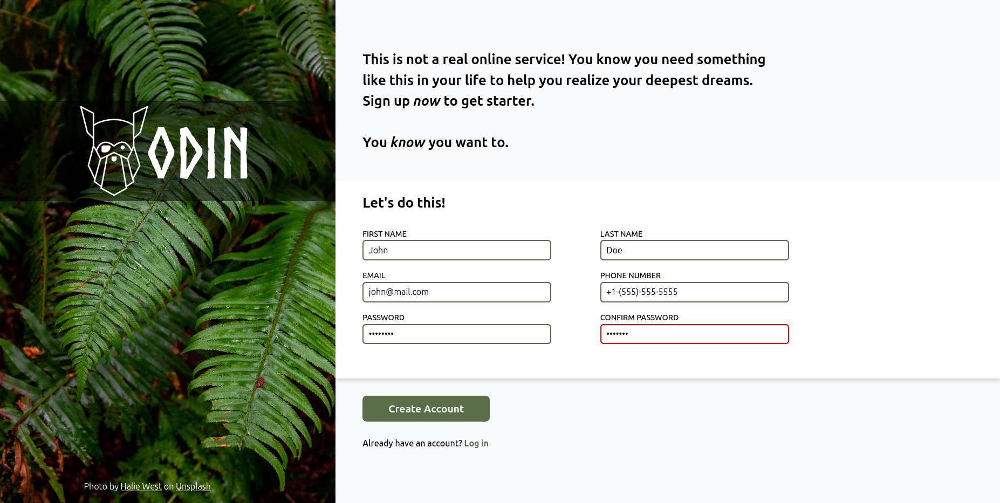

# Sign-up-Form

A simple HTML, CSS form page for user registration.

## How It's Made:

**Tech Used:** HTML, CSS

In this project my process was:

<ol>
    <li>Making a section for the image on the left</li>
    <li>Styling the form section layout</li>
    <li>Styling the form controls and their state</li>
    <li>Adding regex pattern for fields</li>
    <li>Make responsive design for mobile devices</li>
</ol>

The most annoying part for me was to stylizing the layout for form and image so it could evenly split on the page.

## Lesson Learned:

After this project I was able to:

<ul>
    <li>Utilize reset CSS rules</li>
    <li>Use custom variables</li>
    <li>Use relative units for image re-sizing</li>
    <li>Use pseudo-elements for background text</li>
    <li>Use pseudo-classes for input controls states</li>
    <li>Create custom font-face</li>
    <li>Make responsive design</li>
    <li>Write regex patter in client-side for inputs</li>
</ul>